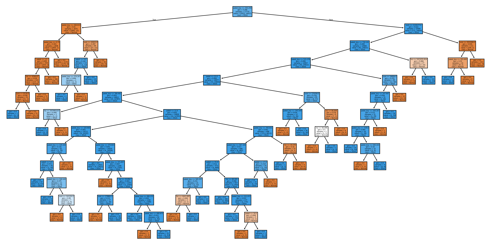

# 🧠 Şafak'ın ML & Network Projeleri

<p align="center">
  
  
  
  
</p>

> Bu repo, Python öğrenme yolculuğumda geliştirdiğim **Makine Öğrenmesi** ve **Ağ Analizi** projelerini içerir.  
> Her proje kendi klasöründe, açıklamasıyla birlikte yer almaktadır.

---

## 📁 Repo Yapısı

## Test

Projeyi test etmek için loopback üzerinde UDP paketi gönderen
bir script kullanılmıştır.

```
📦 ml-network-projects/
 ┣ 📂 ml/
 ┃ ┣ 📂 Çalışma/
 ┃ ┃ ┣ 📄 DDoS_Simulation.py
 ┃ ┃ ┣ 📄 MicroMicro.py
 ┃ ┣ 📂Proje/
 ┃ ┃ ┣ 📄 Yakinda.py
 ┃ ┃
 ┣ 📂 scapyler/
 ┃ ┣ 📂 Çalışma/
 ┃ ┃ ┣ 📄 Tarama.py
 ┃ ┃ ┣ 📄 BelirliPaketiPaketleme.py
 ┃ ┣ 📂 Proje/
 ┃ ┃ ┣  📄 Yakinda.py
 ┃
 ┃ ┣ 📂 BirlesikCalismalar/
 ┃ ┣ 📄Yakında
 ┃
 ┣ 📂 BirlesikProjeler/
 ┃ ┣ 📂UdpTespit/
 ┃ ┃ ┣ 📄 main.py
 ┃ ┃ ┣ 📄 Syn-training.parquet (dataset)
 ┃ ┃ ┣ 📄 requirements.txt
 ┣ 📂 Data/
 ┃ ┣ 🧰 Set.zip
 ┃ ┃
 ┣ 📄 README.md
 ┣ ⭐LICENSE
 ┣ 📄 COMMERCIAL_LICENSE

```

---

## 📜 Lisans

Bu proje iki lisans altında dağıtılmaktadır:

- **Açık Kaynak:** [MIT License](./MIT_LICENSE)
- **Ticari Kullanım:** [Ticari Lisans](./COMMERCIAL_LICENSE)

## 🤖 Sklearn Projeleri

| Proje      | Açıklama          | Algoritma |
| ---------- | ----------------- | --------- |
| 🔜 Yakında | Yakında eklenecek | —         |

---

## 🌐 Scapy Projeleri

| Proje      | Açıklama          |
| ---------- | ----------------- |
| 🔜 Yakında | Yakında eklenecek |

---

## 🌐Birleşik Projeler🤖

| Proje         | Açıklama                                   |
| ------------- | ------------------------------------------ |
| 👩‍💻DDoS Tespit | ⛓DDoS saldırılarını tespit eden model(udp) |

---

## 🛠️ Kurulum

```bash
git clone https://github.com/Safak993/ml-data-science-projects.git
cd ml-data-science-projects.git
pip install -r requirements.txt
```

---

## 📚 Kullanılan Kütüphaneler


---

## 👤 Yazar

**Şafak** — [@Safak993](https://github.com/Safak993)

- 🌐 Website: [safak993.github.io/Website](https://safak993.github.io/Website/)
- 👾 Discord: `mirac2_2`
- 📸 Instagram: [@sung_jinwoo126](https://www.instagram.com/sung_jinwoo126)

---

## 🤖⛓ DDoS Saldırı önleyici botunun öğrenim ağacı:

### 🚀 Model Performance

| Metric             | Value                     |
| :----------------- | :------------------------ |
| **Accuracy Score** | **%99.83**                |
| **Test Split**     | 80/20 (Random State: 42)  |
| **Training Data**  | Pima & SYN-Training Mixed |


_"Kod yazmak sadece bir araçtır, asıl amaç bir şeyler inşa etmektir."_ 💻✨
